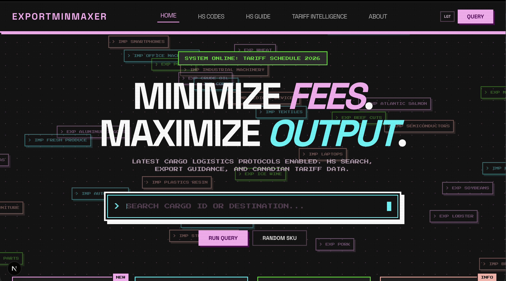
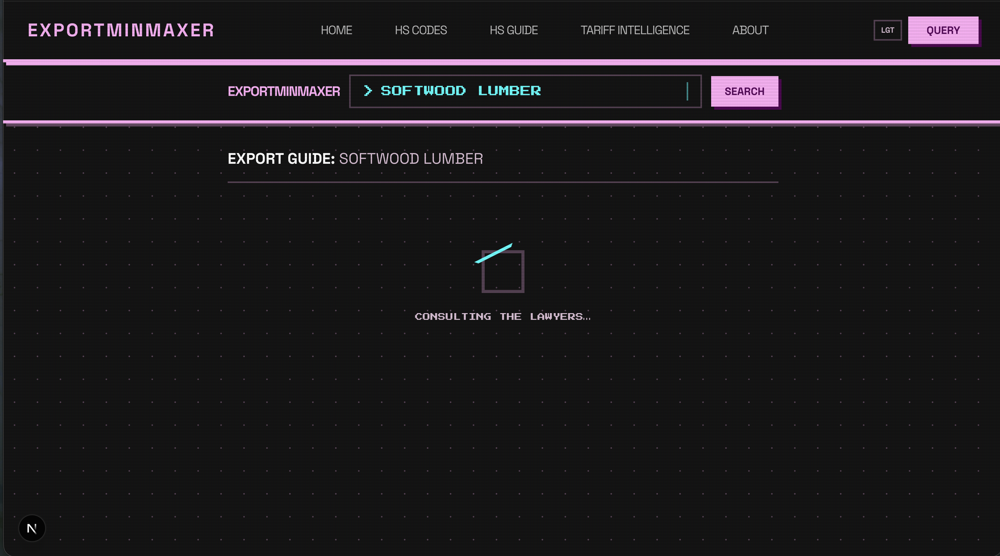
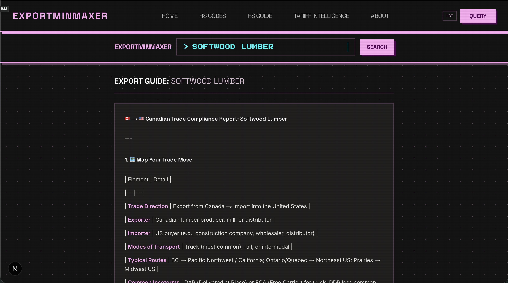
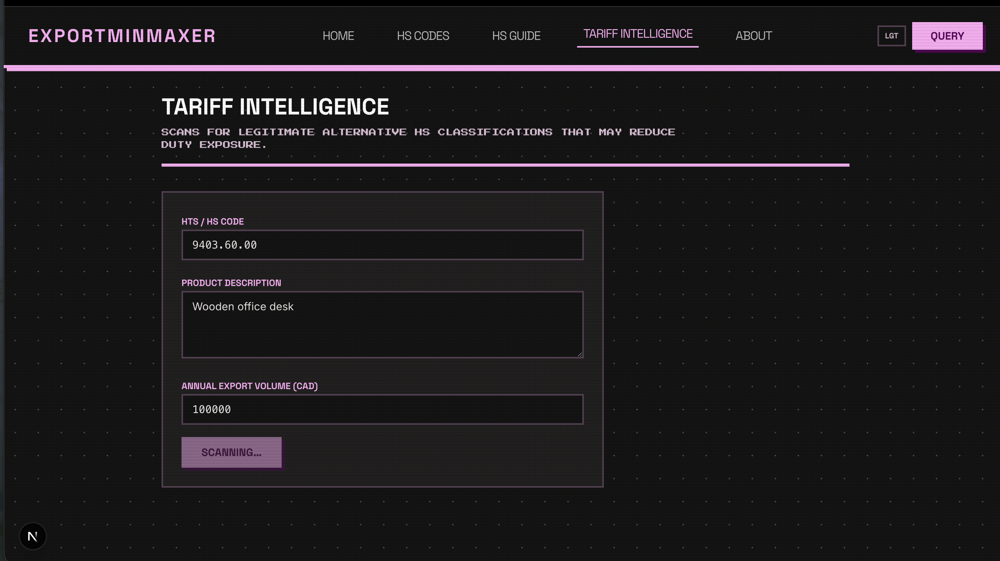
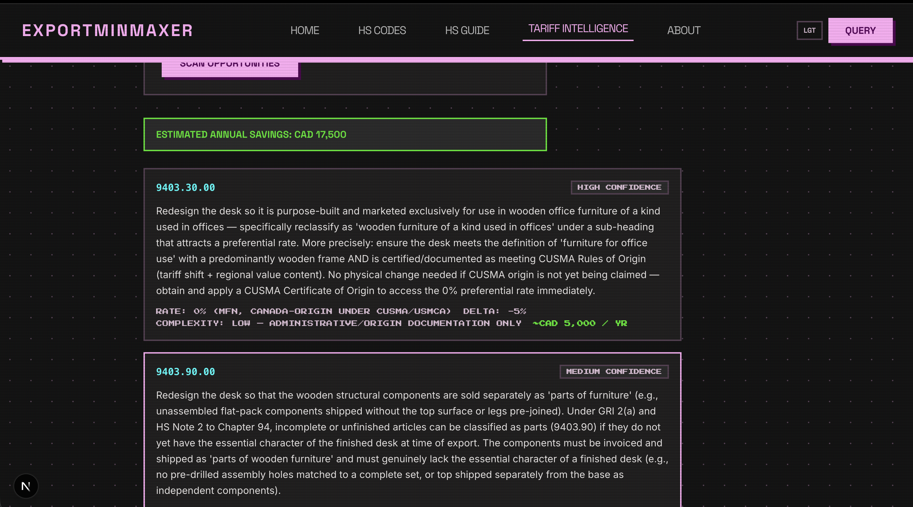

# ExportMinMaxer

**Find permits, HS codes, and requirements to export any product to the US.**

ExportMinMaxer cuts through the complexity of international trade. Whether you ship softwood lumber, canola oil, or natural gas, our tool helps you quickly discover the Harmonized System (HS) codes, permits, and regulatory requirements you need to export from Canada to the United States. No more digging through government sites—search a product and get the answers you need.



### Search



### Results



### Tariff Intelligence





## QuickStart

Start the project (Postgres, backend, frontend) from the `kavi` folder:

```bash
cd kavi
make start
```

`make start` runs `docker compose down` (to clean up any existing containers), then `docker compose up` to bring up all services.

### Service Ports

| Service  | URL                       |
|----------|---------------------------|
| Frontend | http://localhost:3000     |
| Backend  | http://localhost:4002     |
| API Docs | http://localhost:4002/docs |
| Database | localhost:5432            |

### Useful Commands

| Command         | Description                      |
|-----------------|----------------------------------|
| `make status`   | List containers, volumes, networks |
| `make shutdown` | Stop and remove containers       |
| `make watch`    | Monitor status every 5 seconds   |

> **Note:** This project was built for a public hackathon for fun.
